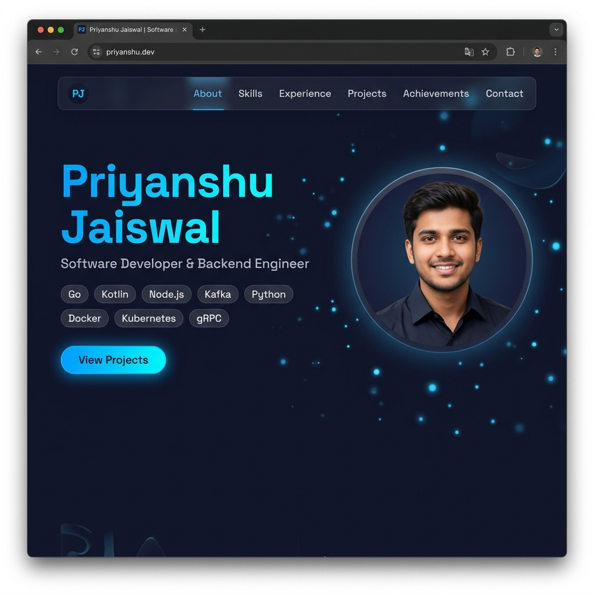
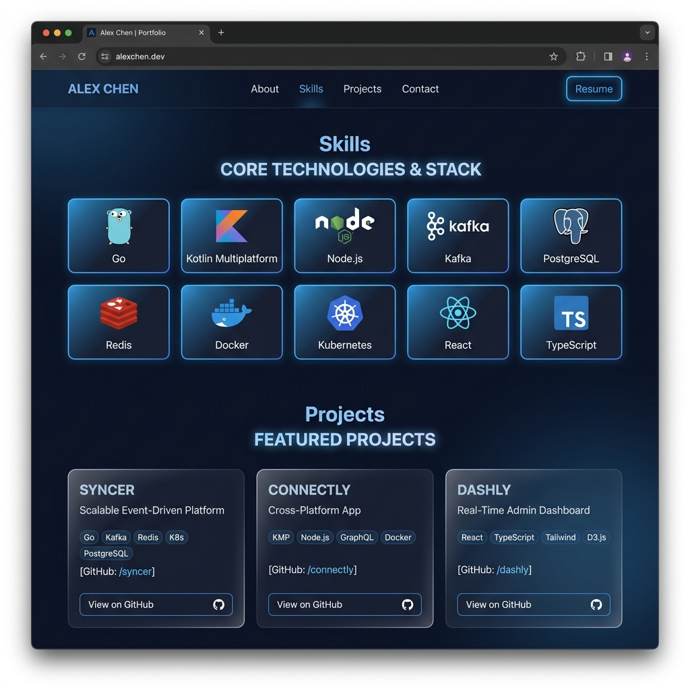
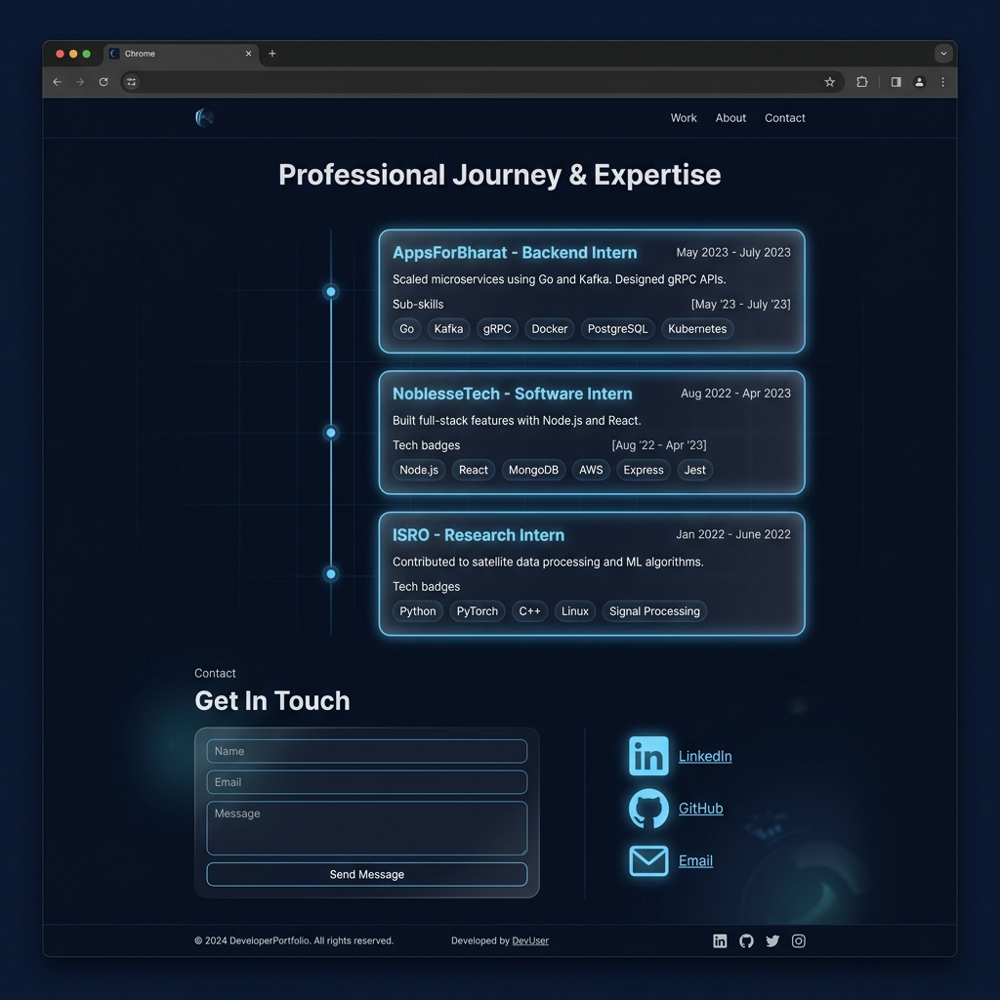

<div align="center">

# 🚀 Priyanshu Jaiswal — Portfolio

**Software Developer & Backend Engineer**

[](https://portfolio-code-six-theta.vercel.app)
[](https://react.dev)
[](https://typescriptlang.org)
[](https://tanstack.com/start)
[](https://vercel.com)

A **premium, dark-mode portfolio** built with TanStack Start (SSR), React 19, Tailwind CSS v4, and deployed on Vercel. Features floating particles, glassmorphism cards, smooth animations, and full mobile responsiveness.

</div>

---

## 📸 Screenshots

### 🏠 Hero Section


### 🛠️ Skills & Projects


### 💼 Experience & Contact


---

## ✨ Features

- 🌙 **Dark / Light Mode** — Auto-detects system preference, persists in `localStorage`
- ✨ **Floating Particles** — Animated background particles for a premium feel
- 🪟 **Glassmorphism UI** — Frosted glass cards with blur and border effects
- 📱 **Fully Responsive** — Mobile-first, works across all screen sizes
- ⚡ **SSR with TanStack Start** — Server-side rendered for fast initial loads & SEO
- 🎭 **Smooth Animations** — Reveal-on-scroll, floating, and micro-interaction animations
- 🗺️ **Sitemap** — Auto-generated XML sitemap for SEO
- 🤖 **Portfolio Mascot** — Interactive animated mascot

---

## 🧩 Sections

| Section | Description |
|---|---|
| **Hero** | Name, title, tech tags, CTA buttons |
| **About** | Background, education, and bio |
| **Skills** | Tech stack with category grouping |
| **Experience** | Timeline with internships (AppsForBharat, NoblesseTech, ISRO) |
| **Projects** | Featured projects with tech badges & GitHub links |
| **Achievements** | DSA milestones, certifications, competitions |
| **Contact** | Contact form + social links |

---

## 🏗️ Tech Stack

| Layer | Technology |
|---|---|
| **Framework** | [TanStack Start](https://tanstack.com/start) (SSR) |
| **Language** | TypeScript 5.x |
| **UI Library** | React 19 |
| **Styling** | Tailwind CSS v4 + tw-animate-css |
| **Components** | shadcn/ui (Radix UI primitives) |
| **Routing** | TanStack Router (file-based) |
| **State** | TanStack Query |
| **Build** | Vite 7 + Nitro (Vercel preset) |
| **Deployment** | Vercel (serverless SSR) |
| **Package Manager** | Bun |

---

## 🚀 Getting Started

### Prerequisites
- [Bun](https://bun.sh) (recommended) or Node.js 20+

### Installation

```bash
# Clone the repository
git clone https://github.com/Priyanshu-jais/protfolio.git
cd protfolio

# Install dependencies
bun install

# Start dev server
bun run dev
```

Open [http://localhost:3000](http://localhost:3000) in your browser.

### Build for Production

```bash
bun run build
bun run preview
```

---

## 📁 Project Structure

```
src/
├── assets/          # Static images and icons
├── components/
│   ├── portfolio/   # Section components (Hero, About, Skills, etc.)
│   └── ui/          # shadcn/ui base components
├── hooks/           # Custom React hooks (useTheme, etc.)
├── lib/             # Utilities, error handling
├── routes/          # File-based routes (TanStack Router)
│   ├── __root.tsx   # Root layout with SEO meta tags
│   └── index.tsx    # Homepage
├── router.tsx       # Router configuration
├── server.ts        # SSR server entry (Nitro)
└── styles.css       # Global styles + design tokens
screenshots/         # Preview images for README
```

---

## 🌐 Deployment

This project is deployed on **Vercel** with SSR via Nitro's Vercel preset.

```bash
# Install Vercel CLI
npm i -g vercel

# Deploy to production
vercel --prod
```

**Live URL:** [https://portfolio-code-six-theta.vercel.app](https://portfolio-code-six-theta.vercel.app)

---

## 📄 License

MIT © [Priyanshu Jaiswal](https://github.com/Priyanshu-jais)

---

<div align="center">
  <sub>Built with ❤️ using TanStack Start + Vercel</sub>
</div>
